## Настройки служебного пользователя 1С
Такой пользователь необходим для того, чтобы под ним выполнялись действия Обновлятора, но при этом, под пользователем-администратором можно зайти в базу и он имеет полные права.

Служебный пользователь также имеет полные права, однако, у него есть отметка о том, что он "служебный" и его не видно в списке пользователей при входе в базу, если используется авторизация 1С. Также он не будет виден в справочнике "Пользователи", но его можно найти в списке "Пользователи информационной базы" и "провалиться" в его карточку.

Обновлятор поддерживает создание пользователей 1С и выполнение различных действий над ними, как вручную, так и автоматически регламентными заданиями.

Создадим и настроим такого пользователя.

1. Прежде всего, из-под пользователя-администратора, указанного в Обновляторе, необходимо выполнить сбор информации о пользователях базы. Она сохраняется в кэш Обновлятора.
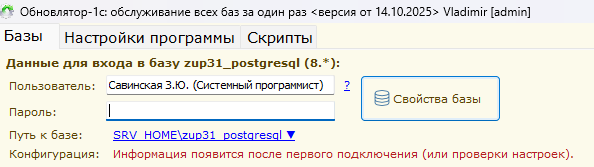

    Для этого на выбранной базе необходимо нажать правую кнопку мыши (ПКМ) и выбрать ```Управление пользователями``` ---> ```Собрать информацию```
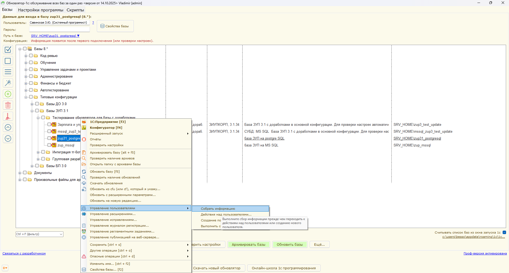

2. Обновлятор выполнит выбранную операцию и предоставит отчет
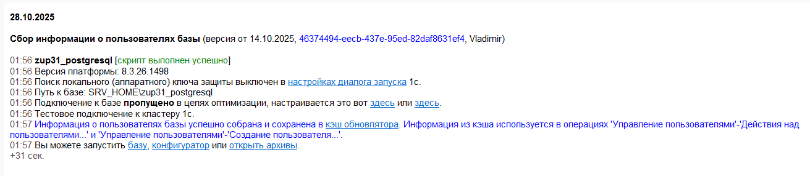

3. Затем нужно вернуться в основное окно Обновлятора и также выполнить ```ПКМ``` ---> ```Управление пользователями```, но уже команду ```Создать пользователя```
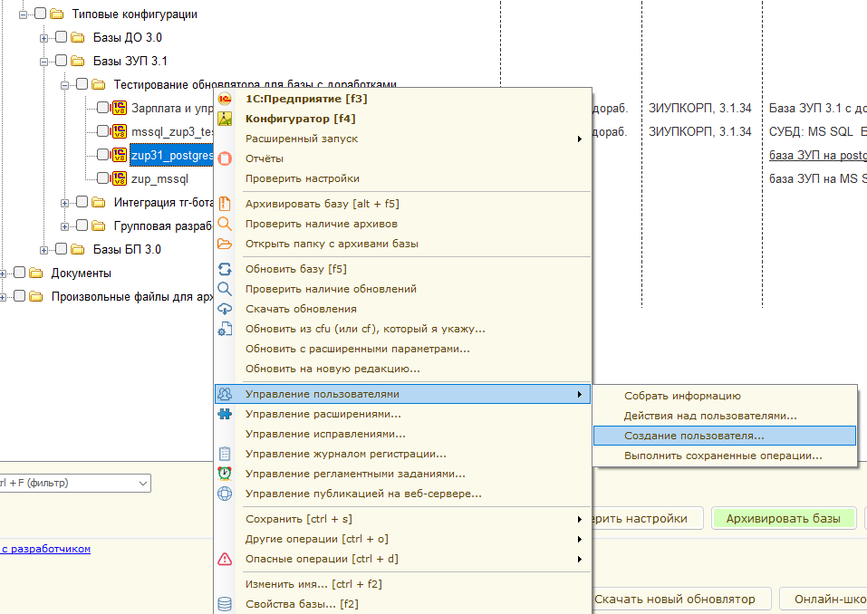

4. Выполнить настройки как на скриншоте ниже. Также есть возможность сохранить или загрузить эти настройки.
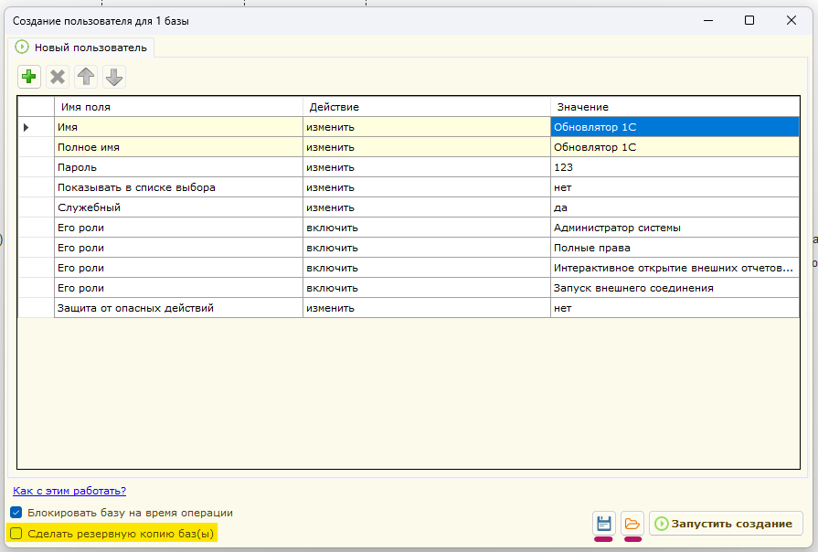
    Рекомендуется сделать резервную копию базы перед созданием или изменением пользователей. 

5. По неизвестной причине после описанных действий не удастся запустить тонкий клиент под служебным пользователем. Возникнет ошибка "Нет прав на запуск требуемого вида клиента". Для того, чтобы ее исправить необходимо выполнить вторую команду - "Действия над пользователями...": точно также - ```ПКМ``` ---> ```Управление пользователями``` ---> ```Действия над пользователями...```
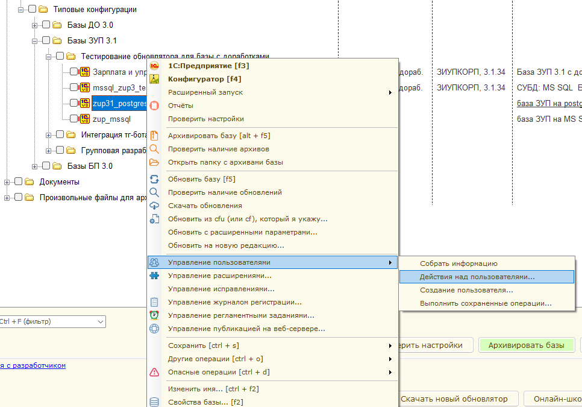

6. На первой вкладке, "Отбор пользователей", задать фильтр, по которому Обновлятор будет искать созданного пользователя в базе.
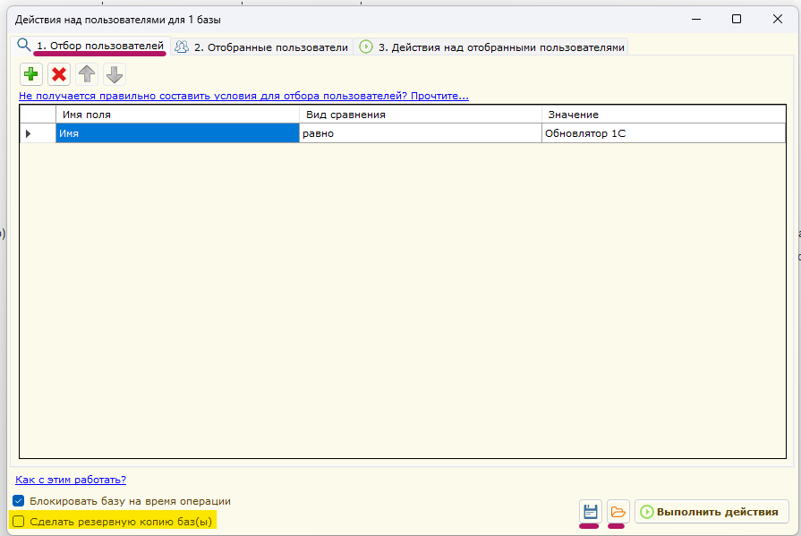

    На второй вкладке убедиться, что пользователь обнаружен
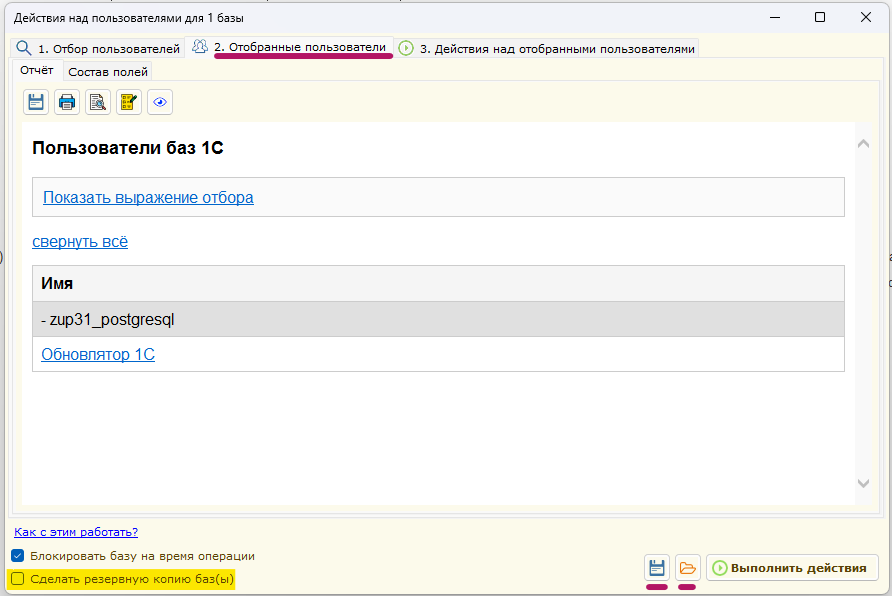

    На третьей вкладке выставить настройки так, как показано на скриншоте ниже.
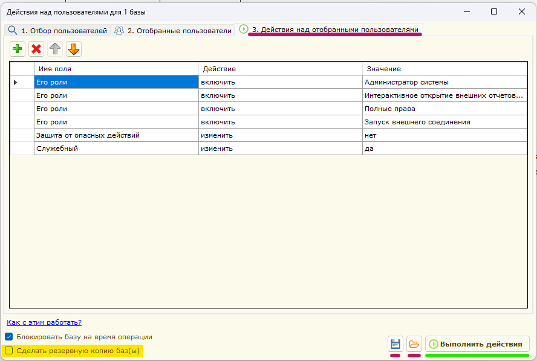

    Роли "Полные права" и "Администратор системы" необходимы для выполнения разных фоновых заданий, например, та же работа с пользователями, выполнение архивации и восстановления. Конфигуратор запускается в пакетном режиме, но, по ограничениям платформы, пользователь, под которым он запускается, должен иметь полные права.
    Роль "Запуск внешнего соединения" нужна для того, чтобы, используя COM-технологию, подключаться к базе и считывать ее настройки.

7. В процессе выполнения действий над пользователями Обновлятор подготовит и выведет отчет о выполненных командах или возникших ошибках.
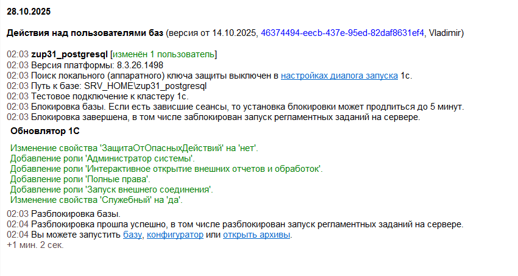

8. Для проверки нужно сменить пользователя Обновлятора на служебного, которого только что создали.
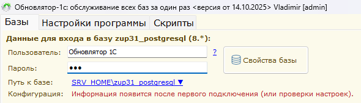

9. Затем произвести запуск 1С в режиме "Предприятие" и убедиться, что нет ошибок.
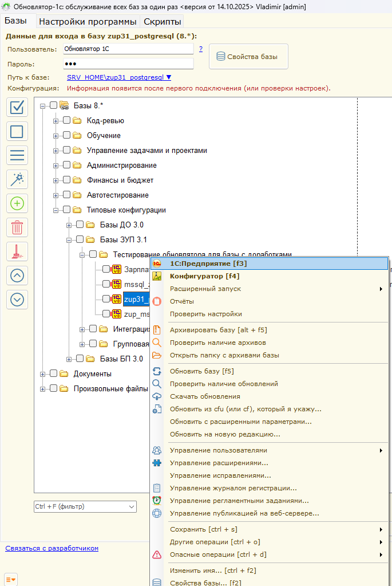

Должна открыться база 1С под служебным пользователем "Обновлятор 1С". Можете проверить - вы не найдете его в справочнике "Пользователи".
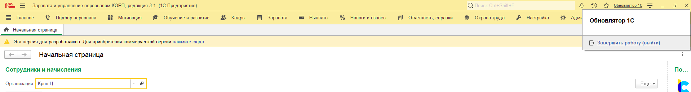

Демонстрацию на видео можете посмотреть в [сообществе в VK "Автоматизация бизнес-процессов"](https://vk.com/club230942526).

