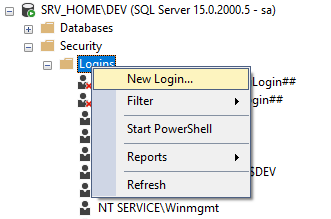

# Безопасность администрирования Обновлятора

Для работы с Обновлятором нужен пользователь СУБД, у которого есть права на архивацию, восстановление и создание информационных баз в клиент-серверном варианте.
Однако, у него не должно быть полных административных прав.

## Настройки пользователя в 1С
Это должен быть "служебный" пользователь. Его видно в списке выбора пользователей при входе в базу, но не видно в справочнике пользователей.

 

Рис.1. Справочник Пользователи, слева - форма списка, справа - форма ПользователиИнформационнойБазы

Перейти непосредственно в элемент справочника "Пользователи" можно только через контекстное меню и команду "Перейти к пользователю"


Рис. 2. Команда перехода к элементу справочника "Пользователи"

В карточке пользователя указано, что он является служебным, причем эта отметка не редактируется.


Рис. 3. Служебный пользователь

Служебного пользователя в 1С можно создать двумя способами:
1. Программно, с помощью скрипта на вкладке "Скрипты" Обновлятора
2. С помощью тестовой версии Обновлятора (в ней есть возможность управления пользователями 1С).

Затем необходимо будет прописать этого пользователя в настройках Обновлятора, чтобы от его имени запускались все операции


Рис. 4. Настройка запуска операций над информационными базами от имени служебного пользователя в Обновляторе


### Программное создание пользователя 
Программное создание пользователя, подробно описано в [статье](https://www.myblog-1c.ru/программное-создание-и-изменение-пол/).


### Создание служебного пользователя с помощью Обновлятора
Есть возможность использовать скрипт на языке OneScript на вкладке "Скрипты" Обновлятора по [инструкции с официального сайта](https://helpme1s.ru/sozdaem-i-udalyaem-polzovatelej-pri-pomoshhi-obnovlyatora-1s) или используйте тестовую версию, т.к. на момент написания этой статьи в основной версии функционал администрирования пользователей был еще не доступен.

## Настройки пользователя СУБД

Для того, чтобы использовать пользователя СУБД с полными административными правами и не нарушать политику информационной безопасности, необходимо создать пользователя updater, который будет только архивировать, восстанавливать и создавать новые информационные базы, но при этом не будет иметь прав на удаление базы, смену пароля.

### Порядок создания служебного пользователя Updater (на примере СУБД MS SQL)

1. Входим в MS SQL Management Studio под суперпользователем


3. Разворачиваем ```Security```, в ней ```Logins```


4. Выполняем команду контекстного меню ```New Login...``` 



5. На вкладке ```General``` устанавливайте настройки, какие вам нужны, или оставьте по умолчанию, создав только пароль.


6. На вкладке ```Server Roles``` выставьте настройки так, как показано на рисунке ниже.


7. На вкладке ```User Mapping``` выставьте настройки так, как показано на рисунке ниже. Желтым маркером выделено наименование информационной базы. У вас будет другое наименование.


7.На вкладке ```Status``` оставьте настройки по умолчанию и нажмите ОК. 


## Примеры ошибок при попытке выполнить запрещенные действия с базой данных

https://github.com/user-attachments/assets/acae36c2-e1aa-438c-8bbb-78bd6afaf69d

